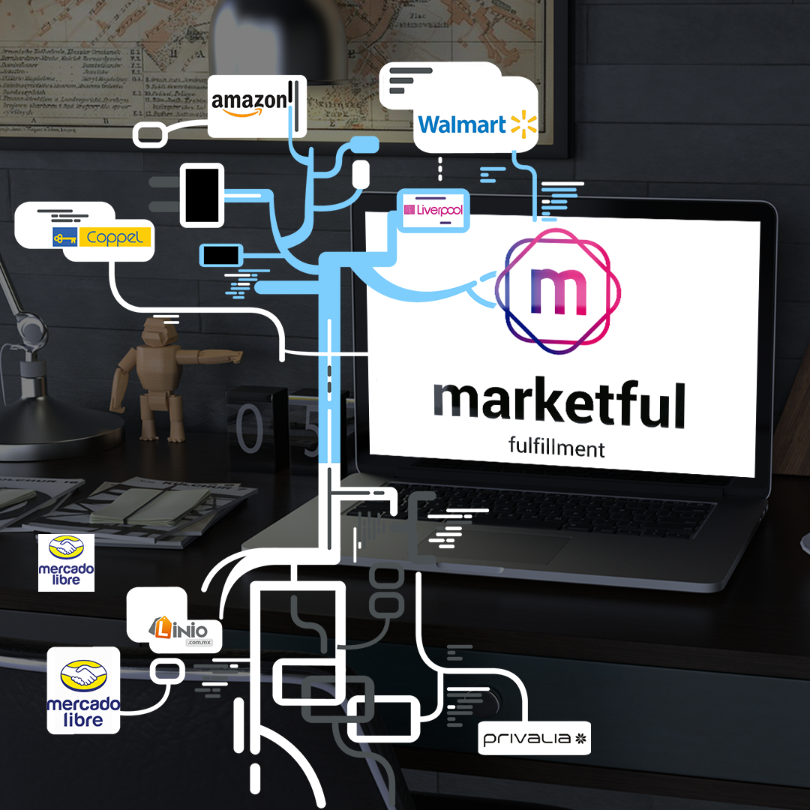
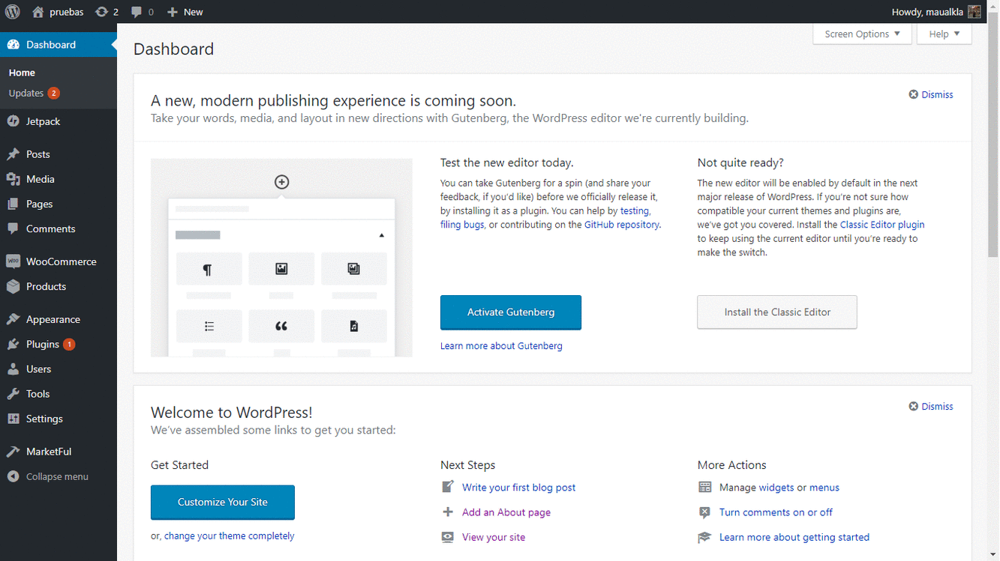

# Marketful 
**Marketful®** Proporcionamos a las personas y empresas que venden via online, herramientas tecnologicas practicas y eficaces, disenadas para simpificar el proceso de comercializacion y distribucion de sus productos.

# Marketful Seller-Center

- **Marketful Seller Center** Es una poderosa herramienta open source que te ayuda a unir todos tus canales de venta en un solo lugar de la manera mas sencilla e intuitiva, lo cual facilitara tu experiencia de venta y lo mas importante la de tus clientes.
- **Controla todos tus canales de venta** con marketful seller center puedes administrar todas tus cuentas de venta en un solo lugar.
- **Cambios controlados** Los cambios dentro de Marketful Seller Center se reflejan en todas tus platadormas.
- **Adios complicaciones** Con Marketful Seller Center se acabaron las horas de modificar productos iguales en pataformas diferentes.
[header](Documentacion/img/page-02(3).jpeg)

## Version 1.0
- **Publicaciones** Con Marketful Seller Center simplicidad es la norma, todos tus productos en un solo lugar y esto se refleja en el poder de publicar tus productos desde un solo lugar y esto se refleje en todos tus canales de venta, con *Marketful Seller Center* estas en buenas manos.
- **Ordenes** Con *Marketful Seller Center* tus ordenes de envio jamas estubieron en tan buenas manos. Monitorea, da seguimiento y da soporte a tus clientes desde un solo lugar, podras monitorear envios no importa en donde realizaste la venta, tu Seller Center lo tiene bajo control.
- **Preguntas** Imagina algo tan sencillo como un centro unico de preguntas en donde podras administrar todos tus canales de comunicacion con tus clientes desde una sola pantalla, esto y mas te ofrece *Marketful Seller Center*.
- **Comunicación post-venta** Dentro de *Marketful Seller Center* podras mantener contacto directo con tus clientes despues de la venta y sin importar el canal por donde se haya realizado.
## Tecnologia
*Marketful Seller Center* se apoya en su robusta capacidad de escalar a las necesidades de cada cliente y a la vez destaca por la simpleza de su instalacion y uso que te permite integrarlo como un plugin en tu pagina de WooCommerce en Wordpress.
Marketful es utiliza una licencia Copyleft de código libre (Open Source) [GPL2](LICENSE.txt) que te permite modificar el codigo y ajustarlo a tus necesidades especificas de información.

## Instalación
*Marketful Seller Center* es un Plugin que puedes tener disponible en tu sitio de Wordpress para poder administrar todos tus canales de venta en linea. Antes de instalar +Marketful Seller Center* es necesario contar con el plugin WooCommerce (Descargalo [aqui](https://public-api.wordpress.com/oauth2/authorize?response_type=code&client_id=50916&state=dfd6f41a8dfe38a4dfef4069580df166&redirect_uri=https%3A%2F%2Fwoocommerce.com%2Fwc-api%2Fwpcom-signin%3Fnext%3Dmy-dashboard&blog_id=0&wpcom_connect=1&new-user=1)) instalado y activo dentro de tu pagina de ventas en Wordpress. 
Instalarlo es sencillo:
+ 1. Ve al repositorio de [Marketful](https://github.com/Skepsis-Consulting/wcplugin) y en el boton "Clone or Download" selecciona download ZIP.
+ 2. Descomprime la carpeta de Marketful.
+ 3. Ve a la carpeta wp/wp-content/plugins en tu cPanel.
+ 4. Sube la carpeta descomprimida de Marketful en esa dirección (paso 3).
+ 4. Dirigete al Wordpress admin y logueate con tu usuario y contraseña.
+ 5. Ya despues de loguearte dirigete al apartado plugins.
+ 6. Aparecera una lista de plugins, da clic en activar que aparece debajo del plugin Marketful.
+ 7. A continuacion deberas tener las opciones de marketful en tu barra lateral izquierda, da clic en *Marketful*.
+ 8. Se desplegara un menú que contiene varias opciones, da clic en "Dashboard".
+ 9. Aparecera un boton en la parte superior izquierda con la leyenda "Conectar", da clic.
+ 10. La pagina te redirigira hacia una pantalla que solicitara que ingreses su Store URL (Ubicación de tu tienda en Marketful).
+ 11. Despues de ingresarlo da clic en "Conectar".
+ 12. Te redirigira a una pagina de autorización, en la cual aceptaras los terminos y servicios.
+ 13. Despues de ello, veras la guia de inicio de *Marketful* en donde se te indicara paso a paso el funcionamiento del plugin.

#### Tabla de contenido
- [Comenzando a usar Marketful](#comenzando-a-usar-marketful)
- [Conectar tus diferentes tiendas](#conectando-tus-diferentes-tiendas)
- [Creando tus productos desde Marketful](#creando-tus-productos-dedsde-marketful)
- [Manejando tus ordenes desde Marketful](#manejando-tus-ordenes-desde-marketful)
- [Mensajes en Marketful](#mensajes-en-marketful)
- [Interfaz amigable](#interfaz-amigable)
- [Totalmente personalizable](#totalmente-personalizable)
- [Estamos para ayudarte](#estamos-para-ayudarte)
- [Licencia](#licencia)

## Comanzando a usar Marketful
Despues de instalar y acceder a **Marketful Seller Center** es muy sencillo comenzar a utilizarlo, con nuestra [guia](Documentacion/iniciando.md) de inicio podras facilmente y en cuestion de minutos enlazar tus tiendas y dar de alta tus productos.
.jpeg)

## Conectar tus diferentes tiendas
**Marketful Seller Center** te permite conectar tus diferentes tiendas, actualizar tus productos, el stock, los precios y mas dentro de ellas desde la pantalla de Marketful. Todo en un solo lugar asegurando que lo que hagas en **Marketful Seller Center** se reflejara en todos tus canales de venta.

## Creando tus productos desde Marketful
**Marketful Seller Center** te permite agregar tus productos en nuestro plugin lo cual se puede ver reflejado en las tiendas y canales de venta que tengas conectados con nosotros. Tu decides que vender en que lugar de la manera mas sencilla.

## Manejando tus ordenes desde Marketful
**Marketful Selleer Center** a travez del Seller Center te permite llevar seguimiento de tu envio, desde el primer minuto hasta que llegue a la puerta de tu cliente. Te ofrecemos el menejo de guias de una manera sencilla y completamente confiable.

## Interfaz Amigable
**Marketful Seller Center** te ofrece un diseño y una interfaz totalmente amigable, en cuestion de minutos podras estar dande de alta tus primeros productos y manejando tus ordenes existentes gracias a su intergaz amigable y basada en los principales sitios de venta online.

## Totalmente Personalizable
**Marketful Seller Center** y su licencia te permiten que adaptes el plugin a tus necesidades de la manera que mejor te convenga.

## Estamos para ayudarte
**Marketful Seller Center** es para ti que buscar ir mas alla, acceder a los grandes mercados y continuar con un crecimiento  escalable. Marketful es tu gran aliado a la hora de vender en linea.
*Contacto: preguntas@marketful.com*

## Licencia
General Public Licence V2.0 [GPL2](LICENSE.txt)