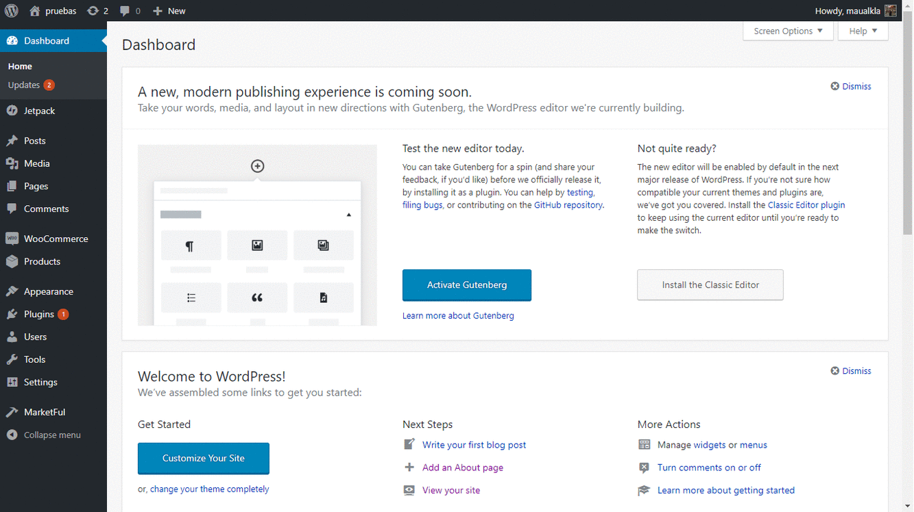

# Marketful 
**Marketful®** Proporcionamos a las personas y empresas que venden vía online, herramientas tecnológicas prácticas y eficaces, diseñadas para simplificar el proceso de comercialización y distribución de sus productos.

<h1 align="center"></h1>

# Marketful Seller-Center

-  **Marketful Seller Center** Es una poderosa herramienta open source que te ayuda a unir WooCommerce y Mercado Libre  en un solo lugar de la manera más sencilla e intuitiva, lo cual facilitara tu experiencia de venta y lo más importante la de tus clientes.
-  **Controla tus canales de venta** con *marketful seller center* puedes administrar tus cuentas de WooCommerce y Mercado Libre en una sola plataforma y ahorrando clics.
-  **Cambios controlados** Los cambios dentro de *Marketful Seller Center* se reflejan  en WooCommerce y Mercado Libre con solo presionar un boton.
- **Adiós complicaciones** Con Marketful Seller Center se acabaron las horas perdidas  modificando productos iguales en plataformas diferentes.
.jpeg)

## Colaboración
- En *Marketful* tenemos muy en cuenta la gran comunidad de programadores que desean participar con nosotros y todo lo que puede aportar la colaboracion de todos, por lo cual *Marketful Seller Center* es un proyecto Open Source que se enfoca en la colaboración para mejorar de manera sustanciosa el desarrollo de este proyecto. Contactanos para orientarte en todas las maneras que puedes apoyar y unirte a nuestro proyecto.

## Versión 1.0
-  **Publicaciones** Con *Marketful Seller Center* dentro de una sola pantalla puede modificar unagran cantidad de atributos de cada publicacion que tengas en mercado libre.
- **Status Masivo** Creamos la funcion *status masivo* que te permite de una manera sencilla activar, pausar o finalizar todas o algunas de tus publicaciones de una sola vez. Ademas te permite cambiar el tipo de exposicion de la misma forma.
- **Descripcion General** Creamos ademas, una herramienta que permite añadir a todas las publicaciones en Mercado Libre una descripcion personalizada, simplificando y limitando el tiempo perdido en actividades repetitivas.
- **Calculo de Costos de Envio** Ahora muestra el calculo del costo de envio en tu publicacion, asi como el costo de comision. Todo tomando en cuenta el producto, la exposicion, el precio y la forma en la que se enviara a tus clientes.

## Tecnologia
*Marketful Seller Center* se apoya en su robusta capacidad de escalar a las necesidades de cada cliente y a la vez destaca por la simpleza de su instalación y uso que te permite integrarlo como un plugin en tu página de WooCommerce en Wordpress.
Marketful es utiliza una licencia Copyleft de código libre (Open Source) [GPL2](LICENSE.txt) que te permite modificar el código y ajustarlo a tus necesidades.

## Instalación
*Marketful Seller Center* es un Plugin que puedes tener disponible en tu sitio de Wordpress para poder administrar todos tus canales de venta en línea. Antes de instalar *Marketful Seller Center* es necesario contar con el plugin WooCommerce (Descárgalo [aqui](https://public-api.wordpress.com/oauth2/authorize?response_type=code&client_id=50916&state=dfd6f41a8dfe38a4dfef4069580df166&redirect_uri=https%3A%2F%2Fwoocommerce.com%2Fwc-api%2Fwpcom-signin%3Fnext%3Dmy-dashboard&blog_id=0&wpcom_connect=1&new-user=1)) instalado y activo dentro de tu página de ventas en Wordpress. 
Instalarlo es sencillo:
+ 1. Ve al repositorio de [Marketful](https://github.com/Skepsis-Consulting/wcplugin) y en el botón "Clone or Download" selecciona download ZIP.
+ 2. Descomprime la carpeta de Marketful.
+ 3. Ve a la carpeta wp/wp-content/plugins en tu cPanel.
+ 4. Sube la carpeta descomprimida de Marketful en esa dirección (paso 3).
+ 4. Dirígete al Wordpress admin y logueate con tu usuario y contraseña.
+ 5. Ya después de loguearte dirígete al apartado plugins.
+ 6. Aparecerá una lista de plugins, da clic en activar que aparece debajo del plugin Marketful.
+ 7. A continuación deberás tener las opciones de marketful en tu barra lateral izquierda, da clic en *Marketful*.
+ 8. Sigue las indicaciones, completa el Onboarding y estaras listo para utilizar Marketful.

#### Tabla de contenido
- [Comenzando a usar Marketful](#comenzando-a-usar-marketful)
- [Conecta WooCommerce y Mercado Libre](#conectando-tus-diferentes-tiendas)
- [Creando tus productos desde Marketful](#creando-tus-productos-dedsde-marketful)
- [Manejando tus ordenes desde Marketful](#manejando-tus-ordenes-desde-marketful)
- [Mensajes en Marketful](#mensajes-en-marketful)
- [Interfaz Amigable](#interfaz-amigable)
- [Totalmente Personalizable](#totalmente-personalizable)
- [Estamos para ayudarte](#estamos-para-ayudarte)
- [Licencia](#licencia)

## Comenzando a usar Marketful
Después de instalar y acceder a **Marketful Seller Center** nuestro Onboarding paso a paso te llevara por las principales funciones para que en cuestion de minutos puedas estar utilizando *Marketful*
.jpeg)

## Conecta WooCommerce y Mercado Libre
**Marketful Seller Center** te permite conectar tus diferentes tiendas, actualizar tus productos, el stock, los precios y más dentro de ellas desde la pantalla de Marketful. Todo en un solo lugar asegurando que lo que hagas en **Marketful Seller Center** se reflejara de manera automatica en Mercado Libre.

## Creando tus productos desde Marketful
**Marketful Seller Center** te permite agregar tus productos en nuestro plugin lo cual se puede ver reflejado en las tiendas y canales de venta que tengas conectados con nosotros. Tú decides que vender en qué lugar de la manera más sencilla.

## Manejando tus ordenes desde Marketful
**Marketful Selleer Center** a través del Seller Center te permite asignar de manera sencilla y confiable el tipo de envio que se asignara a tu publicacion asi como el costo que este tendra.

## Interfaz Amigable
**Marketful Seller Center** te ofrece un diseño y una interfaz totalmente amigable, en cuestión de minutos podrás estar donde de alta tus primeros productos y manejando tus ordenes existentes gracias a su interfaz amigable y basada en los principales sitios de venta online.

## Totalmente Personalizable
**Marketful Seller Center** y su licencia te permiten que adaptes el plugin a tus necesidades de la manera que mejor te convenga.

## Estamos para ayudarte
**Marketful Seller Center** es para ti que buscar ir mas allá, acceder a los grandes mercados y continuar con un crecimiento escalable. Marketful es tu gran aliado a la hora de vender en línea.
*Contacto: preguntas@marketful.com*

## Licencia
General Public Licence V2.0 [GPL2](LICENSE.txt)

